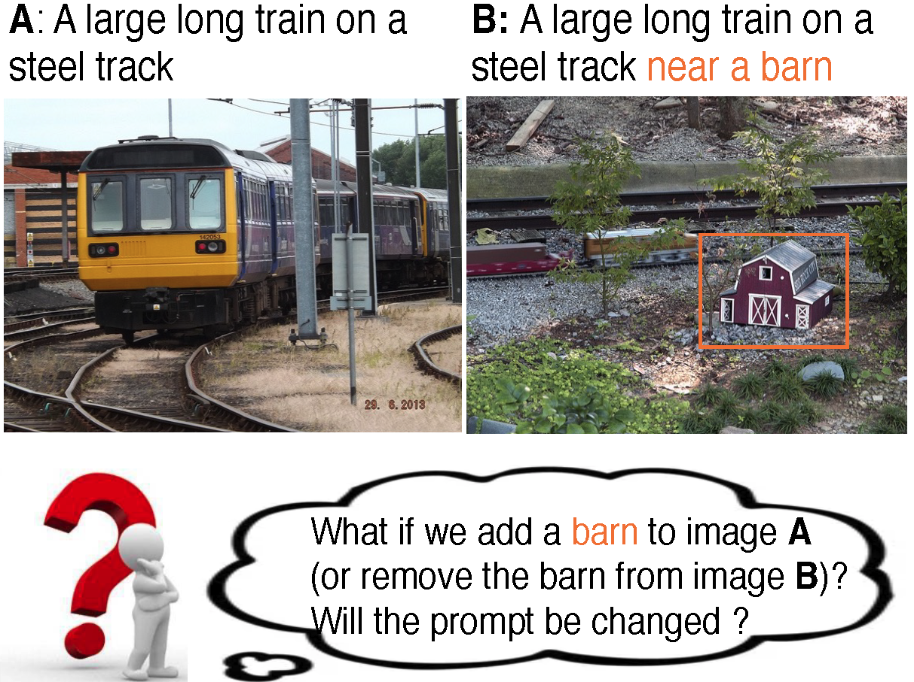

# CPL: Counterfactual Prompt Learning for Vision and Language Models

This repo contains the codebase for <a href="https://arxiv.org/abs/2210.10362"> CPL: Counterfactual Prompt Learning for Vision and Language Models

<p align="center">
  
</p>

## How to Install
This code is built heavily on top of the toolbox [Dassl.pytorch](https://github.com/KaiyangZhou/Dassl.pytorch), so you need to install the `dassl` environment first. 
To install the toolbox, you need to follow the instructions described in the original codebase [here](https://github.com/KaiyangZhou/Dassl.pytorch#installation) to install `dassl` as well as PyTorch. 
The engine is updated to be adapted to this work. So you also need to clone Dassl.pytorch from this repo.


## Dataset preparation
- Follow [DATASETS.md](CPL/DATASETS.md) and download the datasets used.
- Follow instructions in the [dataset_processing](CPL/dataset_processing) repo to preprocess the datasets.
- The off-the-shelf prompts of VQAv2 that can be used for customized purpose are available at [prompt](CPL/prompt)


## Dependencies

You'll need a working Python environment to run the code. The code is based on `python 3.6` and `pytorch 1.6`.
The recommended way to set up your environment is through the [Anaconda Python distribution](https://www.anaconda.com/download/) which provides the `conda` package manager.

The required dependencies are specified in the file `requirements.txt`.

Run the following command in the repository folder (where `requirements.txt` is located) to create a separate environment and install all required dependencies in it:

```shell
conda create -n env_name python=3.6   # create new environment
source activate env_name
pip install -r requirements.txt
```


## Reproducing the results

Before running any code you must activate the conda environment:

    source activate env_name

or, if you're on Windows:

    activate env_name

This will enable the environment for your current terminal session. 


#### Running arguments: 
You can lauch corresponding experiments by passing the given arguments
```sh
cd CPL
python train.py 
```
for baseline method; Or 
```sh
cd CPL
python train_cf.py 
```
for CPL method.

Avaliable arguments are:

| Parameter          | Description  |
| :----------------: | :------------|
| --root ${DATA} \   | Your dataset location|
| --seed ${SEED} \     | Random seeds         |
| --trainer ${TRAINER} \ |CoCoOpcf/CoCoOp/zsclip    |
| --dataset-config-file configs/datasets/${DATASET}.yaml \ |Dataset onfig location|
| --config-file configs/trainers/${TRAINER}/${CFG}.yaml \ |Trainers config location|
| --output-dir ${DIR} \ | output directory location|
| DATASET.NUM_SHOTS ${SHOTS} \  | # shots for classification/ 0.5 1 3 5 for ITR and VQA|
| DATASET.SUBSAMPLE_CLASSES fewshot | 'fewshot' for ITR and VQA/ number e.g. 4 8 16 for classifcation|

Examples are for baseline:
```sh
cd CPL
# TRAINER=ZeroshotCLIP
TRAINER=CoCoOp
python train.py \
    --root /path/to/datasets \
    --seed 1 \
    --trainer ${TRAINER} \
    --dataset-config-file configs/datasets/mscoco.yaml \
    --config-file configs/trainers/${TRAINER}/vit_b16_c4_ep10_batch1_ctxv1.yaml \
    --output-dir output \
    DATASET.NUM_SHOTS 1 \
    DATASET.SUBSAMPLE_CLASSES fewshot
```
for cpl:
```sh
cd CPL
python train_cf.py \
    --root /path/to/datasets \
    --seed 1 \
    --trainer CoCoOpcf \
    --dataset-config-file configs/datasets/mscoco.yaml \
    --config-file configs/trainers/CoCoOpcf/vit_b16_c4_ep10_batch1_ctxv1.yaml \
    --output-dir output \
    DATASET.NUM_SHOTS 1 \
    DATASET.SUBSAMPLE_CLASSES fewshot
```

Or you can use bash

```sh
cd scripts
sh cocoop/main_cpl.sh $dataset 
```
for methods

## Code structure
```
Main/
├── Dassl.pytorch
│   ├── Dassl
│   │   ├── engine (modified trainer and dataset loader for CPL)
│   │   │   ├── ...
│   │   ├── evaluation (modified evaluator for ITR and VQA)
│   │   │   ├── ...
│   │   ├── metrics (mesaured metrics)
│   │   │   ├── ...
│   │   ├── ...
│   ├── ...
├── datasets (datatset processing files, added flickr8k, 30k, mscoco, and vqav2)
│   │   ├── flickr8k.py 
│   │   ├── flickr30k.py
│   │   ├── mscoco.py
│   │   ├── vqav2.py
├── trainers
│   ├── cocoop.py (original CoCoOp)
│   ├── cocoopcf.py (CPL)
│   ├── zsclip.py (zeroshot CLIP)
├── prompt (T5 generated prompts for VQAv2)
├── train_cf.py (main training file for CPL)
├── train.py (main training file for CoCoOp)
├──  ...
```


## Acknowledgements
We thank the authors of [CoOp](https://github.com/KaiyangZhou/CoOp) and [CoCoOp](https://github.com/KaiyangZhou/CoOp) for releasing their code and engine. We thank the authors of [CLIP Models are Few-shot Learners](https://arxiv.org/pdf/2203.07190.pdf) for their method of VQA prompt generation.


## Citation
To do.
<!---
Please consider citing the paper if you find it useful. Thks! :)
```
To be added
```
-->